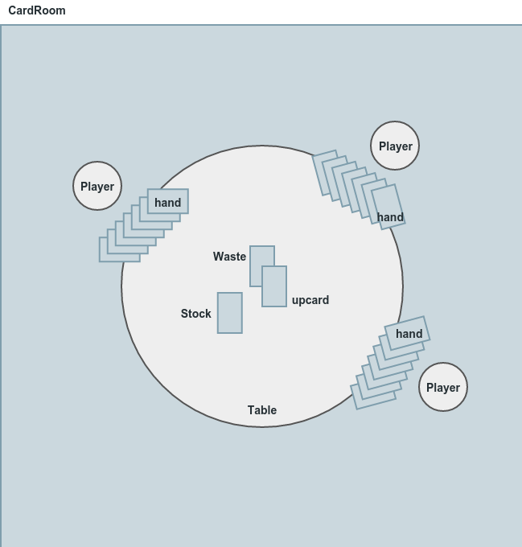

[](https://travis-ci.org/obestwalter/mau-mau)

# Mau Mau 

> The purpose of computing is insight, not numbers.

> --Richard Hamming

**Part of the [Python Exploration Toolkit](https://github.com/obestwalter/pet)**

This serves to showcase a complete Python application and explores an approach to development that could be called "programming as non-linear storytelling".

## OOOMMM (Obvious Object Oriented Mau Mau Modelling)

Switching into egghead mode, you could say that a game of Mau Mau can be modelled as a series of interactions between actors with adjustable attributes and behaviours modifying their own attributes and initiating reactions and attribute changes in other actors. If you call the actors objects and the behaviour methods you have a basic description of object oriented programming.

> Object-oriented design is, in its simplest form, based on a seemingly elementary idea. Computing systems perform certain actions on certain objects; to obtain flexible and reusable systems, it is better to base the structure of software on the objects than on the actions. 

> [Bertrand Meyer - Object-Oriented Software Construction](http://www.win.tue.nl/~wstomv/quotes/meyer.pdf) 

That's all very ... abstract, isn't it? Yes it is! Meyer goes on:

> Once you have said this, you have not really provided a definition, but rather posed a set of problems: What precisely is an object? How do you find and describe the objects? How should programs manipulate objects? What are the possible relations between objects? How does one explore the commonalities that may exist between various kinds of objects? How do these ideas relate to classical software engineering concerns such as correctness, ease of use, efficiency?

What does that tell us? OO is just one of many ways of thinking about the problems you are trying to solve with software. Sometimes that way of thinking matches well with the problem you are trying to solve. There are also a lot of possibly very different answers to the questions posed by Meyer and they manifest in very different approaches to the implementation of OO in different programming languages.

### Implementation

We will model the game flow using [custom Python classes](https://docs.python.org/3/tutorial/classes.html#classes) and see where we get.

#### The basic rules of Mau Mau

>  The game is played with a regular deck of playing cards. The players are dealt each a hand of cards (usually 5). The rest are placed face down as the drawing stack. At the beginning of the game the topmost card is revealed, then the players each get a turn to play cards.

> One can play a card if it corresponds to the suit or value of the open card. E.g. on a 10 of spades, only other spades can be played or other 10s. If a player is not able to, they draw one card from the stack. If he can play this card, he may do so, otherwise he keeps the drawn card and passes his turn. If the drawing stack is empty, the playing stack (except for the topmost card) is shuffled and turned over to serve as new drawing stack.

> -- [Wikipedia - Mau Mau](https://goo.gl/r7D63W)

##### Special rules

We add the three most common additional rules:

* If an eight is played the next player is skipped
* If a seven is played, the next player has to draw two cards. The next player can put another seven down and instead the following player will have to draw four cards (and so on).
* The player who plays a Jack can ask for a different suite to be played

#### High level view

One koan in the [Zen of Python](https://www.python.org/dev/peps/pep-0020/) says: "If the implementation is easy to explain, it may be a good idea". Let's put this to the test and explain the implementation of our Mau Mau program by simply describing the conditions and rules of the game using a rough approximation of the programs' terminology and see if the objects and their interactions make the implementation look obvious. Objects used in the program are marked `like this`, functions that describe (inter)actions are marked like **this**). The game can also be described in two phases, we could call "setup" and "play". The image shows all the important elements of the simulation.



**setup:** The `players` in the `cardroom` are **invited** to a `game` at the `table`. A `deck` of `cards` is **shuffled**. The same amount of cards is **dealt** to the `players` to form their `hand`. One `card` - the `upcard` - is **drawn** from the `stock` and placed face up on the `table`. The remaining cards are `piled` face down on the `table` and form the `stock`. Now all is in place to **play** the `game`. 

**play:** The `players` play in `turns`. They choose a`card` that is **playable** with the `upcard` according to the rules (same `suit` or same `value` and [special rules](#special-rules)) and place it on the `table`. The played `card` ist the new  `upcard` and the old `upcard` is now part of the `waste`. Now the next `player` is up. If a player can't find a `card` to play, they have to draw one from the `stock` and the next `player` is up. If the `stock` `is empty`, the `waste` `cards` will be **shuffled** to form the new `stock`. The game is over and the `winner` is found as soon as one `player` plays the last card of their `hand`.

Easy enough to explain. This description of the rules and the gameplay can double already as a high level explanation of the implementation. It can also be read as an abstract story about a game, where the concrete story would be the description of an actual game. The program code can be viewed as story shape or abstract plot, with different executions of it as concrete stories. If you have no idea what I mean just watch [Kurt Vonneguts short talk about the shape of stories](https://www.youtube.com/watch?v=oP3c1h8v2ZQ) and transfer your insights into thinking about abstract program code and its concrete execution :)

## Programming as non-linear storytelling

Earlier on the term "programming as non-linear storytelling" was introduced. I have to admit that I just made that up when trying to find a way to explain how working code often develops in a very non-linear way. 

Most of the time when I think that I came up with an original idea, I find out that somebody already wrote a paper about it in 1972. So, when I come up with a term or concept that I think could be original, I deflate my ego right away by [googling it](https://goo.gl/JGfXTL). I then usually find a whole bunch of blogs and articles that use that term already and most of the time explain it better than I could. With this one I drew **almost** a blank. The links referred to non-linear storytelling in computer games or maths topics that did nonlinear stuff with things (don't ask me - I am really not into advanced mathematics). And **exactly one link** about programming - the very first hit. It is an article about Ji-Sun Ham who uses a visual programming language called [Scratch](https://scratch.mit.edu/) to teach kids programming. This resonated with me:

> She started with a survey of current software developers, asking if they thought programming was a linear or non-linear process. "The surprising result was that the more number of years a programmer had under his or her belt, he or she was more inclined to say it's non-linear versus those with only one to three years, who would say that it's more linear than non-linear. I wondered how that could affect those wanting to learn how to program but then got discouraged because they can't think that linearly. Since it was always presented that way in school, how might a non-linear way encourage more students to learn programming isn't so intimidating?"

> \[...\]

> Ji-Sun's experience learning with Scratch and creating for other's learning with Scratch has challenged her assumptions about programming, storytelling, and personalized learning. "Programming isn't scary, and it's not only a certain group of people can really program. Programming isn't as linear as you think it is, just as storytelling really isn't as linear as you think it is."

> [Reading, Writing, Remixing: Programming Non-Linear Stories with Scratch](http://scratched.gse.harvard.edu/stories/reading-writing-remixing-programming-non-linear-stories-scratch)

Telling a story by starting in the middle and jumping back and forth on the timeline and switching between minute details and pig-picture-thinking is a lot like how you go about creating software and also how you should go about exploring an existing code base that you want to use or adapt. Code is not linear. Building software is a creative process. Period. 

Please don't try to think that you need the whole picture of how the program works when starting to develop. It is more like an exploration of ideas and a constant struggle to find the right structure that tells the story in the right way (and there are many "right" ways - or none ... depends on whether you are in a glass-half-full or glass-half-empty kind of mood). There are important details that evade you for a long time until they reveal themselves to you and improve your understanding of the problem and your capability of solving it. Once you understood them, you might realize you have to rewrite some parts of the story to make the whole thing consistent again. Creating software is a learning process and the existing code is your script of how you see the problem and its possible solutions.
 
 The same applies to reading code. If you try to read any non trivial piece of software from top to bottom, file by file you will not learn much and very likely give up pretty quickly. Calling it "reading code" is very misleading - it should be called ["decoding code"](http://www.gigamonkeys.com/code-reading/) or "exploring code". After all: there is a reason why it's called code. 

Another hint that writing and reading software is not as linear and logical as it might seem is that the alternative translation of my german job description ("Software Entwickler") is "Software Unraveller". How fitting. I unravel software -  I don't develop it :)

## Exploring / unraveling the Mau Mau code

With all this in mind, we can finally move on to look at the code.

This simulation of a simple card game is optimized for being readable, easy to grasp and to demonstrate a whole range of concepts. It is not a toy example, but the nasty details that usually screw with our nice and simple design and make the code grow tentacles and other cruft is not (yet) part of the code and so it can be read like a nice little story. Even in this simple state it is already non-linear though and it came into live in a non-linear fashion.

### Features of this implementation

* Basic rules of Mau Mau (no special rules regarding 7, 8, or Jack)
* Players "strategy" is to choose the first playable card in their hand
* Functions to run multiple games and collect stats
* Flexible [command line interface](mau_mau/cli.py) (add new functions without adjusting code)
* [automatic tests](tests/) with py.test
* Logging with the stdlib [logging module](https://docs.python.org/3/library/logging.html)
* Use of [Python protocols](https://docs.python.org/2/reference/datamodel.html#special-method-names) to create custom classes which behave like inbuilt data types

### [`sim.py`](sim.py)

The overall plot of the Mau Mau story can be found here. It is written in an [imperative](https://en.wikipedia.org/wiki/Imperative_programming) way (like a series of commands given to the computer). The code looks like a series of instructions which are to be carried out in a top down order, descending into the functions being called. The order can be influenced by loops (`for ... in` or `while`) and conditioned branches (`if ... then ... else`). These are the basic control flow constructs Python has. There are a few more, but not many.

#### The central simulation function

```python
def play_game(players=3, cardsPerPlayer=5):
    game = start_new_game(players, cardsPerPlayer)
    while not game.over:
        game.next_turn()
        play_turn(game.player, game.table)
    return game
```

This is the meat of the simulation. Here is where all the magic happens. if you call this function a game of Mau Mau will be simulated and a winner is determined. **6 lines of code** including the function header and the return statement. You now have read the whole plot of the fascinating Mau Mau story. If you want to understand more, you can start digging deeper and visit the definitions of the functions used in the play function. Reading and understanding the functions (in whatever order you might prefer) in this file means that you get the picture how a simulation of a simple turn based card game works.

### [`cardroom.py`](mau_mau/cardroom.py)

This looks pretty different from `sim.py` and it is. Here is where the OO part of the story kicks in. If `sim.py` contains the plot, `cardroom.py` contains the descriptions of the actors and props of the story. It describes the relevant part of the virtual universe that is created to run the simulation. It contains custom data structures (a.k.a. classes) to model the problem of simulating Mau Mau. You should be able to read through the classes and get an idea of what elements are needed to simulate a card game and how they might interact. The order in which the classes are defined are from compounded to simple.

### [`stats.py`](mau_mau/stats.py)

Contains some functions to run the game simulations and collect statistics. 

### [`cli.py`](mau_mau/cli.py)

This is the entry point and can be executed from the command line. `python ./cli.py` or simply [`./cli.py`](mau_mau/cli.py) executes the standard function that runs simulations and creates statistics from the results ([`stats.time_durations`](mau_mau/stats.py#L25)). If you call it with a command line argument (e.g. `./cli.py mean_turns`) the argument will be passed to `get_function_from_name` that fetches a function object of the same name from [`sim.py`](mau_mau/stats.py) and executes it. This is a very simple way to create a flexible command line interface that does not need to be changed if you create more statistics functions in `stats.py`. Adding a new function to `sim.py` will automatically make it accessible through the command line interface.

### [setup.py](setup.py) Installable package

To develop or explore the code it is best if you install the [package as editable](https://pip.pypa.io/en/stable/reference/pip_install/#editable-installs) into a virtualenv. This way all the paths are working correct for all use cases (e.g. running the tests) and the command line access also installed.

Install the package as editable with 

        cd </path/to/your/clone>
        pip install --editable .
        
The dot at the end of the command is **not a typo**! It means: install the contents of the folder that I am currently in as an editable package.

### Files for automatic testing and CI

#### [tests/](tests/): testing with [py.test](http://pytest.org)

The ability to write simple functions to test your code cannot be developed early enough, so why not start this right away as well? The examples are dead simple and not covering much yet, but show that it's not rocket science to write automatic tests for your code. Pytest makes it possible to use the inbuilt `assert` for writing tests.

##### Testing on the command line

Make sure, you you installed the package as editable.

    cd </path/to/your/clone>
    py.test
    
output like:

    ============================= test session starts =============================
    platform linux -- Python 3.4.3, pytest-2.9.1, py-1.4.31, pluggy-0.3.1
    rootdir: /path/to/your/clone/mau-mau, inifile: tox.ini
    collected 13 items 
    
    tests/test_pile.py .....
    tests/test_player.py ...
    tests/test_sim.py .....
    
    ========================== 13 passed in 0.03 seconds ==========================

##### Testing in PyCharm

###### Preparation

The default testrunner in PyCharm is Unittest. You have to switch to py.test like so: 
* **Find Action: [default testrunner](https://www.jetbrains.com/help/pycharm/2016.1/testing-frameworks.html)**: set to py.test 
* accept offer to install it in your project virtualenv or do it yourself with `pip install pytest`

###### Running tests

Depending on where you are, you can run all tests are part of them. The magic action is [`run context configuration`](https://www.jetbrains.com/help/pycharm/2016.1/creating-and-saving-temporary-run-debug-configurations.html). It runs what is sensible in the context. If your focus is in a normal script it runs the script and if the focus is in a module defining tests it will run the configured testrunner with the tests. Running the context configuration with ...

* focus in the editor, inside a specific test
* focus in the editor on the line defining a class containing tests
* focus in the **Project Tool Window**, choose the `tests/` folder and 

... all yields different results as which tests are run (and they are what you would intuitively expect).

#### [tox.ini](tox.ini): testing with tox [tox](tox.readthedocs.org)

Tox is one level up from py.test and can serve as an easy testrunner for different kinds of local tests and also acts a a frontend for external test runners as part of [CI](https://en.wikipedia.org/wiki/Continuous_integration). It automatically creates an environment for the tests, installs the dependencies and the package under tests and outputs the results.

command line usage:

    cd </path/to/your/clone>
    tox
    
output like: 

    flake8 develop-inst-nodeps: </path/to/your/clone>/mau-mau
    flake8 installed: flake8==2.5.4,mccabe==0.4.0,-e git+git@github.com:obestwalter/mau-mau.git@ba0af5660852415dc8cd44a499ad0a67958119be#egg=OOOMMM-master,pep8==1.7.0,py==1.4.31,pyflakes==1.0.0,pytest==2.9.1,wheel==0.24.0
    flake8 runtests: PYTHONHASHSEED='2381292392'
    flake8 runtests: commands[0] | flake8 </path/to/your/clone>/mau-mau/mau_mau </path/to/your/clone>/mau-mau/tests --show-source
    unittests develop-inst-nodeps: </path/to/your/clone>/mau-mau
    unittests installed: flake8==2.5.4,mccabe==0.4.0,-e git+git@github.com:obestwalter/mau-mau.git@ba0af5660852415dc8cd44a499ad0a67958119be#egg=OOOMMM-master,pep8==1.7.0,py==1.4.31,pyflakes==1.0.0,pytest==2.9.1,wheel==0.24.0
    unittests runtests: PYTHONHASHSEED='2381292392'
    unittests runtests: commands[0] | py.test </path/to/your/clone>/mau-mau/tests
    ============================= test session starts =============================
    platform linux -- Python 3.4.3, pytest-2.9.1, py-1.4.31, pluggy-0.3.1
    rootdir: </path/to/your/clone>/mau-mau/tests, inifile: tox.ini
    collected 13 items 
    
    tests/test_pile.py .....
    tests/test_player.py ...
    tests/test_sim.py .....
    
    ========================== 13 passed in 0.03 seconds ==========================
    ___________________________________ summary ___________________________________
      flake8: commands succeeded
      unittests: commands succeeded
      congratulations :)

This is a very simple setup There are many more [configuration options](https://tox.readthedocs.org/en/latest/config.html)

#### [.travis.yml](.travis.yml): integrate with [Travis CI](https://travis-ci.org/)

The badge on top of this readme show the [build status from Travis CI](https://travis-ci.org/obestwalter/mau-mau). 

This is a very simple setup. There are many more [configuration options](https://docs.travis-ci.com/user/customizing-the-build/).

### Use of custom [classes](https://docs.python.org/3.5/tutorial/classes.html)

Yes I know, you basically just learned about functions and variables inside of modules, but by having learned that you know almost everything already to start writing your own classes. The modelling problem we have here is a good fit to create your own data structures (which classes are), so here they are and they don't bite. 


## Things to point out

### Python does argument passing by assignment

> Remember that arguments are passed by assignment in Python. Since assignment just creates references to objects, there’s no alias between an argument name in the caller and callee, and so no call-by-reference per se.

> -- [How do I write a function with output parameters (call by reference)?](https://docs.python.org/3.5/faq/programming.html#how-do-i-write-a-function-with-output-parameters-call-by-reference)

In our code the `play_turn` function could als be a method of the `Game` class. Vice versa the `next_turn` method could just as well be a function. This works without having to return the objects which are modified in the functions, because only their contents are modified. The way passing data to functions work in Python is [quite specific](https://jeffknupp.com/blog/2012/11/13/is-python-callbyvalue-or-callbyreference-neither/), so it is important, that you are aware of it and understand it. Walk through this example in the [tutor](http://goo.gl/MeBNPV) to visualize what is really happening when you pass mutable objects into functions and e.g. append elements to a list object that was passed into a function. In the example it is a list but this holds true for any object that contains references to other objects. To use an example in `play_turn`: the player object is passed in and it contains a reference to the players' `hand`. If the player plays a card it will taken from the hand and it is not necessary to either return the player object or in some way to communicate the update of the `hand`. 

Changing the state of an object that is not returned explicitly is called a [side effect](https://goo.gl/3n4nXW). Purists of certain programming paradigms would tell you that this style is messy and error prone. I won't argue with them, because I might loose. For now that's how we do it here, because than you really understand how it works. Real world programs have lots of side effects anyway so better just get used to it :) The discussion around when and how to use side effects is a huge topic. For now I just want to make you aware, that some of our functions and methods have side effects, meaning that not all changes to the state of the program are communicated purely by returning values. BTW: raising exceptions are also considered side effects and they are used a lot in Python.

### Assertions

> What can be asserted without evidence can be dismissed without evidence.

> -- Christopher Hitchens

To assert something means "to state or express positively". Assertions are regarded as important enough in Python, that [`assert` is a statement](https://docs.python.org/3/reference/simple_stmts.html#the-assert-statement) (since Python 3 even `print` is not important enough to be a statement). `assert` evaluates an expression and raises an [`AssertionError`](https://docs.python.org/3/library/exceptions.html?highlight=assert#AssertionError) if the result of the evaluation is `False` (with a customizable message to provide more information about the problem). This can be a very simple check like making sure that an object is [truthy](https://docs.python.org/3/library/stdtypes.html#truth) if evaluated as [`bool`](https://docs.python.org/3/library/functions.html#bool). 

```Python
def spam(someObject):
    assert someObject, "Hey! %s is not what I want!" % (someObject)
    print(someObject)
    
spam([1, 2])
spam([])
```

The assert in the `spam` function makes sure, that the argument passed evaluates to `True` before moving on. The first call is o.k. but the second raises the exception and prints the message as part of the traceback.

This is a good way to make sure that your program crashes early if the preconditions are not what you expect them. Like making sure there is a chair under your bottom before you make an attempt to sit down. Used with good measure this can safe you a lot of trouble - finding the good measure for usage of the assert statement in your code is an art and not a science.

Look for uses of the assert statement in the code to get an idea how it might be used.

### Logging

Python has a simple to use and convenient [logging module](https://docs.python.org/3.5/library/logging.html) included. There is no reason why beginners shouldn't learn using that right away in their programs instead of cluttering the code with calls to `print`. One immediate advantage is the possibility to use different [log levels](https://docs.python.org/3.5/library/logging.html) in the program and adjust the output when debugging problems (e.g. `logging.DEBUG` to see the full story while debugging and `logging.WARNING` when running thousands of simulations, where logging would slow us down).

We use a [simple format](https://docs.python.org/3.5/library/logging.html#logrecord-attributes) and the [convenience function](https://docs.python.org/3.5/library/logging.html#logging.basicConfig) to initialize the logger to write to the terminal with a certain level.

### 'Magic' methods (protocols)

Those `__something__()` thingies might look scary for the uninitiated, but you will love them, once you got the idea. These methods are a way to use the internal language mechanics of Python for your own classes. They make up an important part of the Python superpowers and it's never too early to learn about them (you should at least know that they exist and that they have special meaning). Some of them are used in the model classes to create pythonic behaviour of the objects (e.g. make them iterable and comparable) and good representations.

#### Object representation (`__repr__`)

> If at all possible, this should look like a valid Python expression that could be used to recreate an object with the same value

> -- [Python docs](https://docs.python.org/3/reference/datamodel.html?highlight=__repr__#object.__repr__)

In our simple simulation this is actually possible for all objects, so why not do it? You can copy object representations from the log, for example, and recreate them in the REPL. If done right this works correctly when using inheritance as well (see `Stock` and `Waste`).

#### Special module attribute (`__name__`)

`__name__` is an example for a special attribute of a module object. We use it for two purposes in the program:

1. Set the name of the logger object to get information from where the log was written
1. If a module is started directly it has the special name `__main__` - we use this to only execute certain code if the module was started directly (as opposed to being imported as a module). This is the [canonic way](https://docs.python.org/3/library/__main__.html) to do this. 

##### Further information

* [Python docs](https://docs.python.org/3/reference/datamodel.html?highlight=__repr__#special-method-names)
* [A Guide to Python's Magic Methods](http://www.rafekettler.com/magicmethods.html)
* [reprlib helps making better representations](https://docs.python.org/3.5/library/reprlib.html)
